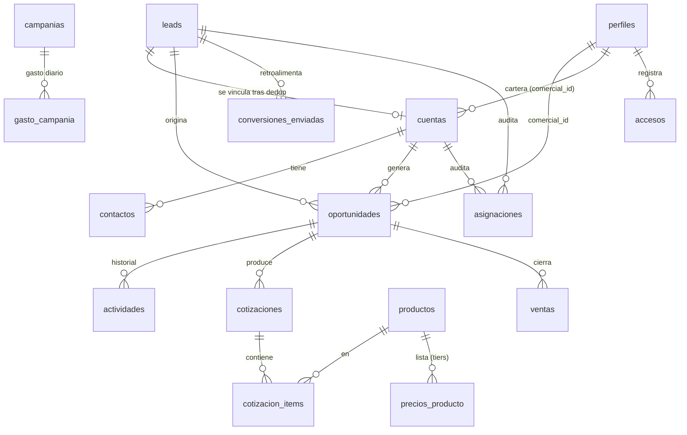

# 02 · Modelo de datos

Fuente de verdad: `supabase/migrations/0001_esquema_inicial.sql`. Este documento explica el porqué de cada pieza.

## Diagrama

## Decisiones de diseño

### `leads` ≠ `cuentas` ≠ `oportunidades`
- **`leads`** = bandeja de Central. TODO contacto entrante, comercial o no (`area_destino`). Un lead no comercial termina en `derivado_area` y no genera nada más — pero queda registrado (si no, Central mantiene un Excel paralelo).
- **`cuentas`** = cliente/prospecto único, deduplicado por RUC/DNI (`uq_cuentas_doc`) y teléfono normalizado. Aquí vive la **cartera** (`comercial_id`, `cartera_desde`, `ultima_venta_at`).
- **`oportunidades`** = una gestión comercial concreta. Una cuenta puede tener varias a lo largo del tiempo (recompra, o derivación tras liberación de cartera).

### Estado en tres dimensiones (reingeniería de `P1_F_Realiz_Y_Cotizado`)
El código actual mezcla etapa+resultado+acción. Se separa en:
1. **`etapa`** (enum): asignada → filtrada → cotizada → seguimiento → potencial → venta | rechazada | derivada
2. **`motivo_rechazo_id`**: obligatorio si etapa = rechazada (constraint)
3. **`proxima_accion` + `proxima_accion_at`**: siempre visible; alimenta "mi día" del comercial y la agenda que hoy se manda a mano

### Atribución de marketing separada del canal
`leads.canal` (VIA: por dónde llegó) es independiente de `leads.fuente` + `gclid/fbclid/utm_*` (ORIGEN: qué campaña lo trajo). Hoy el origen se pierde en ~99% de registros; el CRM lo captura automático en formularios web y webhook de Meta.

### Correlativos en el servidor
Tabla `correlativos` + `siguiente_correlativo()` (SECURITY DEFINER, con lock de fila). Triggers asignan `PRO-#####` a leads y `Presu_###` por serie a cotizaciones. Continúan las series reales de Central — fijar los últimos valores en `seed.sql` antes del piloto.

### Precios y aprobación (decisión gerencia 2026-08-14)
- `precios_producto`: semi-industrial 3 tiers (`optimo`/`medio`/`deseado`), industrial `base`; con vigencia (`vigente_hasta null` = actual).
- Cada `cotizacion_item` guarda **snapshot**: `tier_aplicado`, `precio_lista` y `precio_unitario` ofrecido. Si algún item queda `bajo_lista` → la app pone la cotización en `pendiente_gerencia`.
- Constraint duro: una cotización no puede estar `enviada`/`aceptada` sin `auto_aprobada` o `aprobada_gerencia`.
- ⚠️ Pendiente confirmar con gerencia cuál tier es el piso del vendedor (asumimos `deseado` como el más bajo).

### Cartera y regla de 6 meses
`v_cuentas_liberables` lista cuentas cuyo comercial no vendió en 6 meses (desde `ultima_venta_at` o `cartera_desde`). **No hay reasignación automática**: gerencia decide desde su pantalla y todo queda auditado en `asignaciones` (quién, de quién a quién, motivo, cuándo). El trigger de `ventas` mantiene `ultima_venta_at` al día.

### Cotización con snapshot
`cotizaciones.cliente_snapshot` (jsonb) congela los datos del cliente al momento de cotizar: el PDF regenerado no cambia si la cuenta se edita después.

### Accesos
`accesos` (user, IP, user agent, timestamp) — pedido explícito de gerencia para permitir acceso desde cualquier lugar con trazabilidad. Lo alimenta el middleware de Next.js en cada login/sesión nueva.

### RLS (resumen de la matriz)

| Tabla | comercial | central | gerencia/admin |
|---|---|---|---|
| leads | solo asignados a él (lectura) | todo | todo |
| cuentas | su cartera (todo) | lectura + alta | todo |
| oportunidades, actividades, cotizaciones, ventas | las suyas | lectura (seguimiento) | todo |
| productos, precios, catálogos | lectura | lectura | todo |
| campañas, gasto, conversiones | — | — | todo |
| asignaciones | las que lo involucran (lectura) | alta + lectura | todo |
| accesos | inserta el suyo | inserta el suyo | lectura |

Webhooks y crons escriben con `service_role` (bypassa RLS) — nunca exponer esa key al cliente.

## Fuera del esquema v1 (deliberado)
- **Metas y bonos** — fuera del CRM (RRHH). Dashboard individual del vendedor = v2.
- **Ingesta de mensajes WhatsApp** — sin API en v1; solo `actividades` tipo `whatsapp` registradas a mano (≤15 s).
- **Integración ERP** — prohibida; a lo sumo export CSV.
